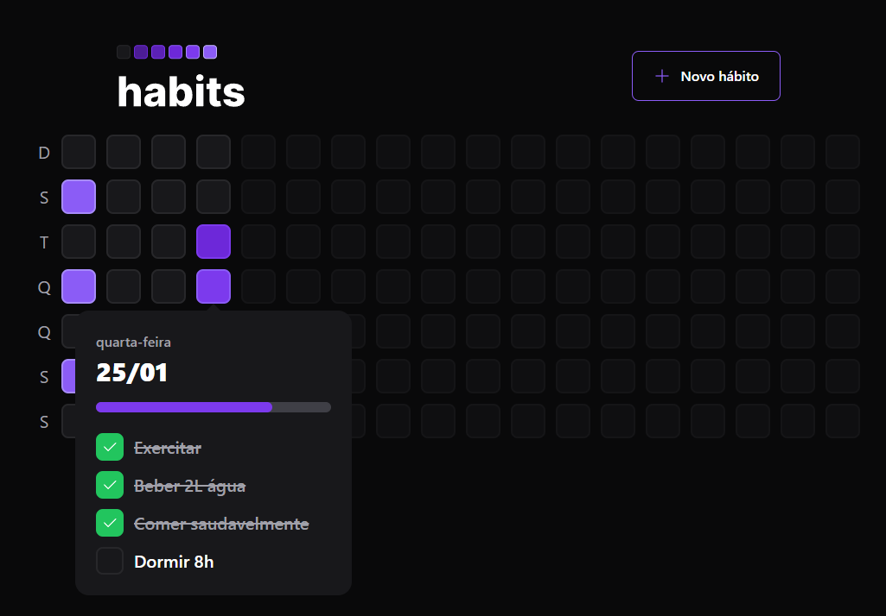
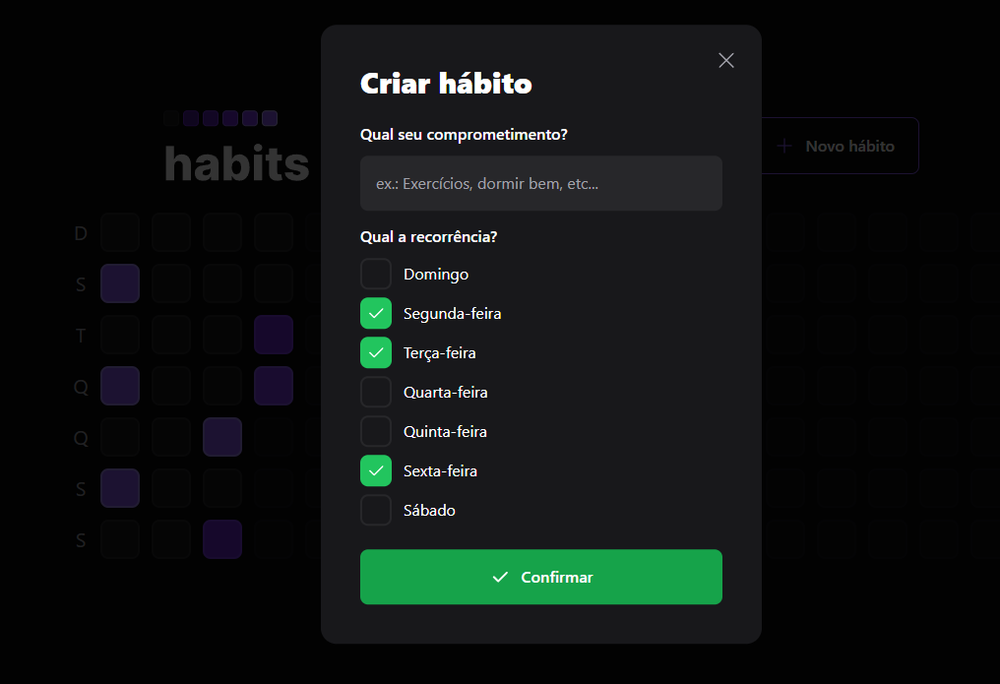

<h2 align="center">
  Controle de hábitos
</h2>

<p align="center">
 <a href="#-sobre-o-projeto">Sobre</a> •
 <a href="#-tecnologias">Tecnologias</a> •
 <a href="#-aplicação">Aplicação</a> • 
 <a href="#-como-executar">Executar</a> 
</p>

## 💻 Sobre o projeto

Essa aplicação foi desenvolvida durante a NLW SETUP realizada pela Rockseat. É um controle de hábitos, você pode registrar todo os dias se você realizado um determinado
hábito ou até adicionar um novo hábito à sua rotina. Foi feito a parte do back-end, do banco de dados e do front-end.

---

## 🛠 Tecnologias

As seguintes ferramentas foram usadas na construção do projeto:

-   **React**
-   **Tailwind**
-   **Typescript**
-   **Node.js**
-   **Fastyfy**
-   **Prisma**
-   **Axios**

## 🚀 Aplicação

<p align="center">
  
</p>

<p align="center">
  
</p>

<p align="center">
  
</p>

---

## 🛠 COMO EXECUTAR

```

# Clone este repositório
$ git clone git@github.com:KaiqueBM/nlw-setup.git

Para rodar a parte do back-end:

# Vá para a pasta server
$ cd server

# Instale as dependências
$ npm install

# Execute a aplicação em modo de desenvolvimento
$ npm run dev

# O servidor inciará na porta:3333 - acesse http://localhost:3333 

Para rodar a parte do front-end:

# Vá para a pasta da aplicação Front End
$ cd web

# Instale as dependências
$ npm install

# Execute a aplicação em modo de desenvolvimento
$ npm run dev

# A aplicação será aberta na porta:5173 - acesse http://127.0.0.1:5173/

```

